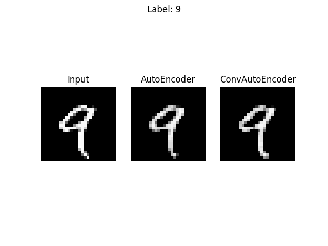

# AutoEncoder

In these repository one can find example of AutoEncoders from two types:
1. Fully connected AutoEncoder.
2. Convolutional AutoEncoder.

Here are some results of each types of network on an "test" examples:

